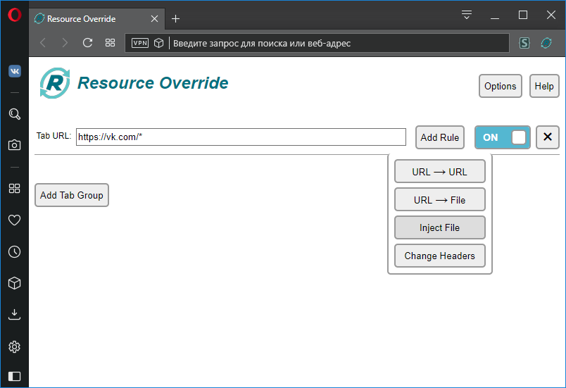
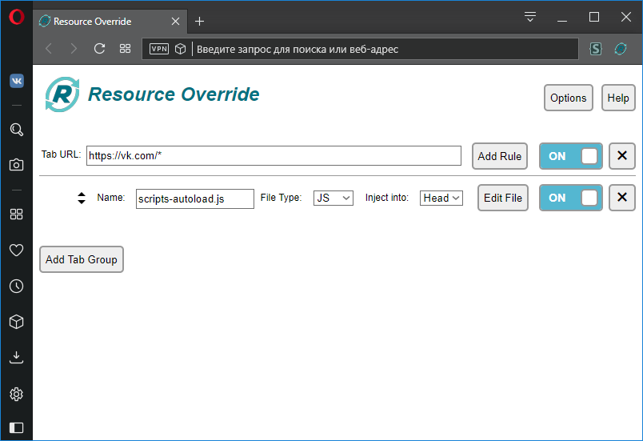
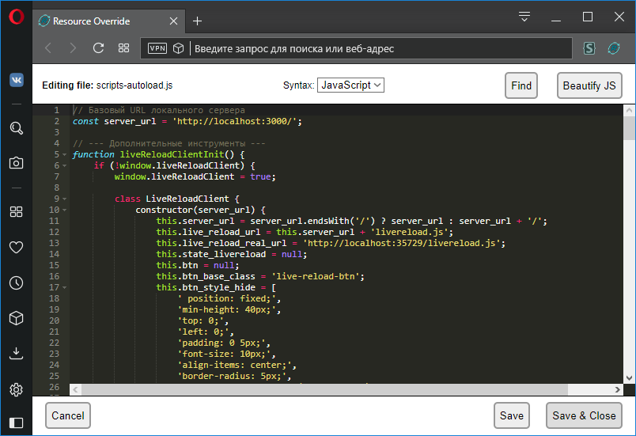
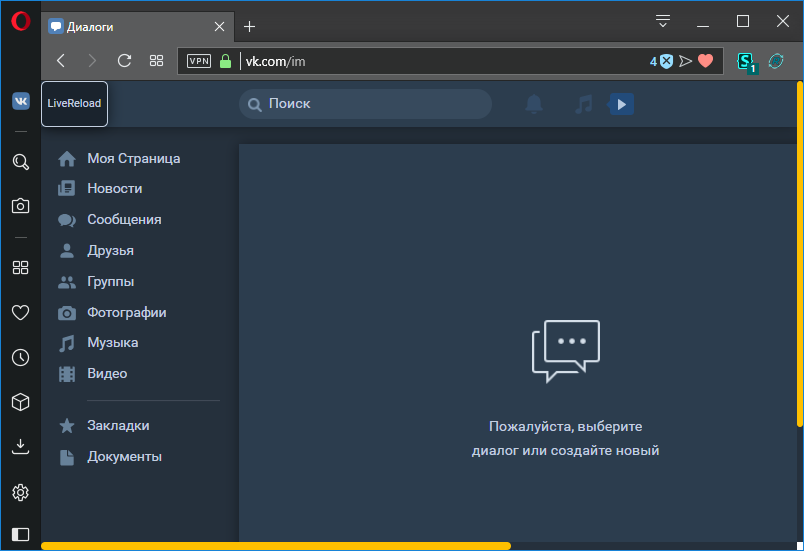

# VK Livereload
Основная идея этого проекта - обеспечить автоматическую подгрузку скриптов из локального проекта на страницу опубликованного в интернете сайта, а так же осуществлять живую перезагрузку страницы при изменени локальных файлов. 

Связь локального проекта с удаленным сайтом осуществляется благодаря скрипту `scripts-autoload.js`, запущенного на странице сайта с помощью одного из расширений браузера, позволяющих в собственном браузере запускать наши скрипты на произвольных сайтах.

Проект можно использовать как шаблон для разработки дополнений к существующим чужим сайтам, в частности он предназначен для работы с vk.com.

## Использование
**Подготовительная часть.** 
1. Скачать или клонировать этот репозиторий в рабочую папку `git clone https://github.com/neyasbltb88/vk-livereload.git`.
2. Установить расширение браузера для запуска собственных скриптов на произвольном сайте. Для примера будет использовано расширение [Resource Override](https://chrome.google.com/webstore/detail/resource-override/pkoacgokdfckfpndoffpifphamojphii?hl=ru).
    - Создать группу ресурсов для нужного URL, затем *Add Rule* -> *Inject File*: 
    - Имя запускаемого скрипта не обязательно, но заполнить его можно для того, чтобы не путать несколько скриптов для текущего URL: 
    - Нажать кнопку *Edit File* и скопировать в открывшийся редактор содержимое скрипта [scripts-autoload.js](./scripts-autoload.js), затем нажать кнопку *Save & Close*: 
    - Перезагрузив страницу с URL, для которого был только что добавлен скрипт, мы должны увидеть в левом верхнем углу кнопку управления состоянием живой перезагрузки: 